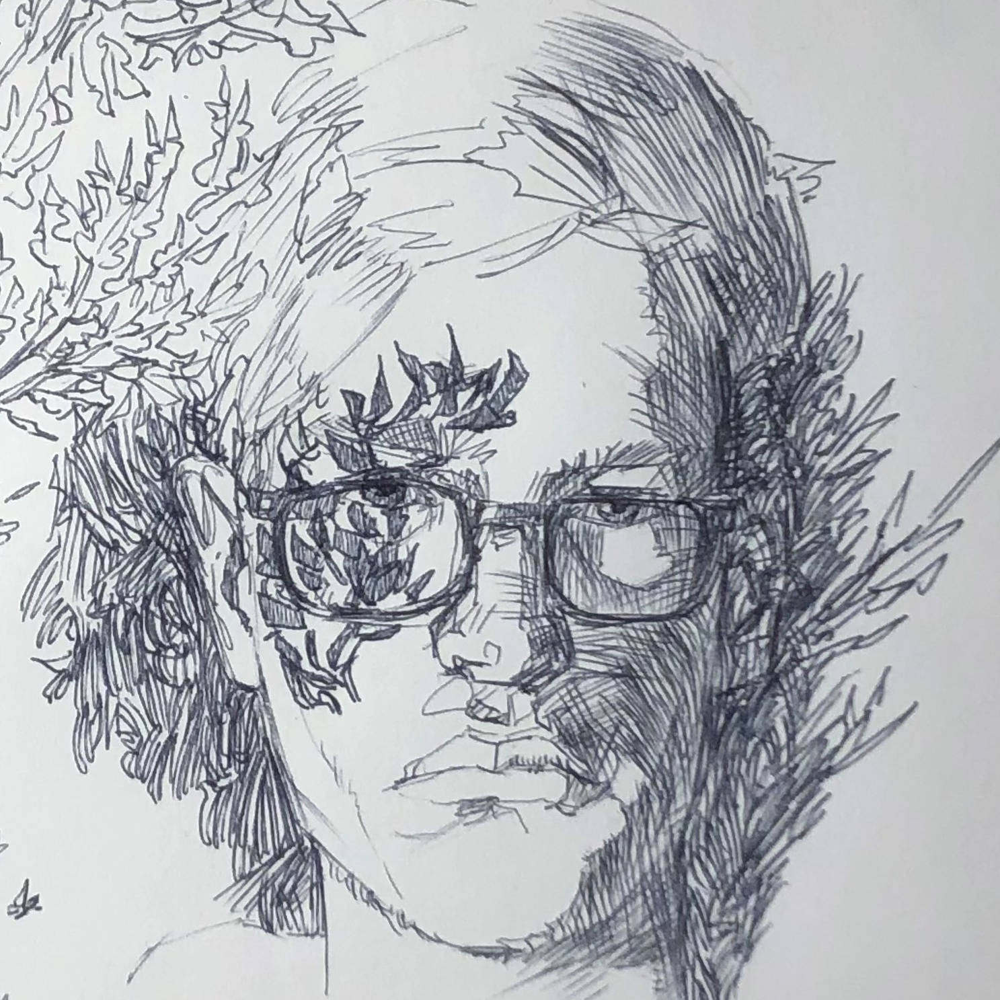

## Hi there! I'm Patrick Schloss.
I'm a junior at John Paul the Great Catholic University, where I'm studying animation with a focus on visual development and illustration.

I grew up on a small family farm in Dexter, Michigan, which formed my sense for the beauty to be found in things like farm animals and snowy days. I am an illustrator by trade and in all my artistic pursuits, I love quiet moments of beauty with cozy nature and character-driven scenes and stories.

## Contact
Check out my social accounts below but the most reliable way to get ahold of me is to send me an email at: patchschloss@gmail.com

### <em>Thanks for visiting my website!</em>
